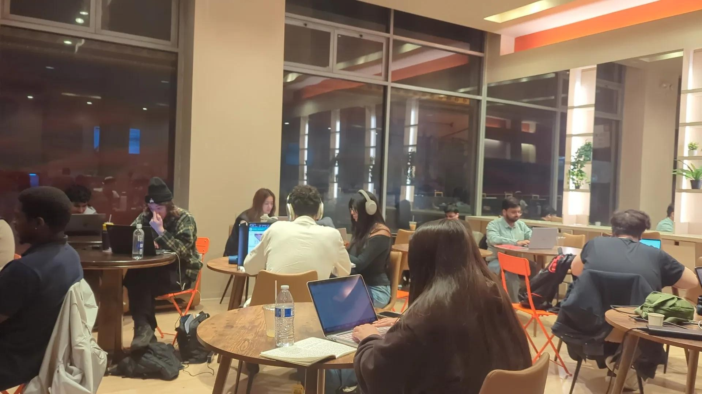

_Photo taken at Corgi Cafe in San Francisco at 8pm on a Tuesday. Corgi is a 24/7 cafe opened by Corgi Insurance, a startup._

The Bay Area startup culture that once prided itself on unlimited PTO is starting to feel a lot like Chinese tech circa 2018.

There are two concepts that arose in Chinese tech around that time: involution (内卷) and lying flat (躺平). If you work in a San Francisco startup right now, you may find yourself living one reality or the other.

Involution (内卷) describes a situation where everyone works harder and harder, for diminishing returns. It's rooted in the fear that if you stop running, someone else will take your place.

996 - working 9am to 9pm, 6 days a week - became the de facto standard in Chinese tech in the late 2010s. It happened because of social pressure: people worked longer hours because their colleagues did. Due to intense domestic competition, companies also felt like they had to adopt the same working norms to stay competitive.

Because of AI-driven productivity expectations and layoff anxiety, this involution theme is now prevalent in San Francisco.

In China, the countermovement that followed involution was lying flat (躺平). If the game is never-ending, why play? Over time, as macro economic pressures settled in, working harder also didn't translate into meaningful financial outcomes - so some people decided to disengage instead.

As AI leads to more involution, more 996, more burnout and perhaps more limited opportunities - I suspect we may see a version of this playing out not just in Silicon Valley, but across the world.

Many people will burn out. A lot of this is not sustainable. My hope is that over time, there will be some breathing room for everyone. What Nikhyal Singhal discussed recently on [Lenny's podcast](https://www.lennysnewsletter.com/p/why-half-of-product-managers-are-in-trouble) is the optimistic version I'm hoping for - perhaps we only need to go through this catch-up phase for a few years.

The same AI pressures reshaping how people work are also reshaping how companies grow and go to market - I wrote about [why B2B founders are becoming the new influencers](/posts/b2b-founders-are-influencers/) recently. If you're building through this transition, [I work with founders on growth strategy and AI-powered execution](/work-with-me).
